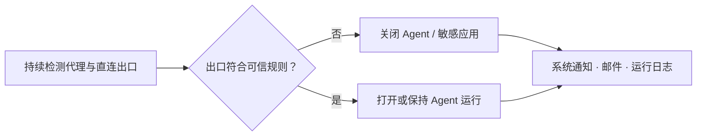
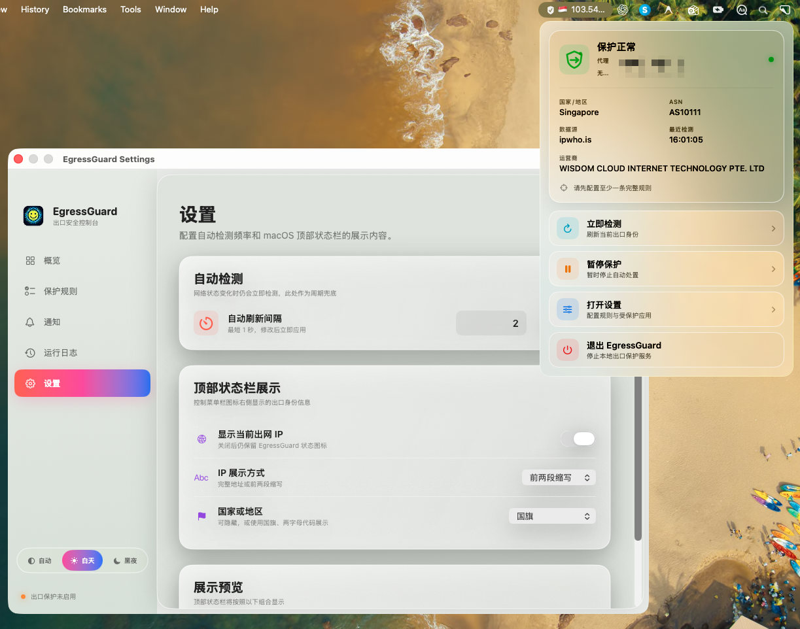

<div align="center">


# EgressGuard

**面向 macOS 的公网出口身份守卫。持续检测代理与直连出口，并在网络身份变化时自动控制关键应用。**

[](https://www.apple.com/macos/)
[](https://www.swift.org/)
[](https://developer.apple.com/xcode/swiftui/)
[](#隐私与安全)

[核心场景](#核心场景) · [功能](#功能) · [界面预览](#界面预览) · [开始使用](#开始使用) · [规则配置](#规则配置) · [隐私与安全](#隐私与安全)

</div>


## 为什么需要 EgressGuard

代理、VPN、TUN 或网络切换可能在用户无感知的情况下改变公网出口 IP。对于持续运行 AI Agent、开发工具、企业通信客户端或其他对网络身份敏感的应用，出口漂移可能导致请求从非预期网络发出。

EgressGuard 在菜单栏后台持续确认两种出口身份：

- **代理出口**：遵循 macOS 当前系统代理设置的请求出口。
- **无代理出口**：显式绕过系统代理的直连请求出口。

当出口 IP、CIDR 或国家/地区命中规则时，EgressGuard 可以立即打开或关闭指定的 macOS 应用，并通过系统通知、邮件和运行日志留下可追溯记录。

## 核心场景

### 为持续 Vibe Coding 增加出口保护

假设 Mac 已配置代理，并持续运行 ChatGPT、Claude、Codex、Antigravity 等 Agent 工具：

1. 为可信代理出口配置 IP 或 CIDR。
2. 添加“代理出口 **不是** 可信 CIDR → **关闭** Agent”的规则。
3. 添加“代理出口 **是** 可信 CIDR → **打开** Agent”的恢复规则。
4. 当代理掉线、节点切换或公网 IP 漂移时，EgressGuard 自动退出 Agent。
5. 当出口恢复到可信网络时，EgressGuard 自动重新打开 Agent，继续工作流。



> [!IMPORTANT]
> 自动检测默认需要连续命中配置的确认次数后才执行动作，用于降低瞬时网络抖动造成的误触发；手动“立即检测”会立即评估当前规则。

## 功能

| 能力 | 说明 |
| --- | --- |
| 双出口检测 | 同时识别系统代理出口和无系统代理出口，发现分流与代理失效。 |
| 灵活规则 | 按代理出口、无代理出口或任一出口匹配 IP、CIDR、国家/地区。 |
| 应用动作 | 规则命中时打开或关闭已安装的 macOS 应用，并支持单条规则测试。 |
| 防抖与恢复 | 连续异常确认后执行，连续恢复确认后回到健康状态。 |
| 邮件告警 | IP 变化、规则执行或运行失败时通过 SMTP 发送邮件；授权码保存在 macOS 钥匙串。 |
| 运行日志 | 持久化记录初始化、检测耗时、规则动作、邮件结果与错误，最多保留最近 1000 条。 |
| 本地网络观察 | 只读展示本机网络接口、IPv4 路由和邻居缓存，并区分物理网卡、回环、VPN/隧道及系统虚拟接口。 |
| 菜单栏控制 | 查看当前出口身份，立即检测、暂停保护、打开设置或退出应用。 |
| 开机自启动 | 由用户主动选择是否注册为 macOS 登录项，默认关闭。 |
| 自适应界面 | 支持自动、白天与黑夜主题，以及菜单栏 IP 和国家/地区展示。 |

## 界面预览

### 本地网络

只读查看 macOS 当前网络接口与 IPv4 路由，不会修改系统网络配置。页面会结合系统硬件端口元数据和 BSD 接口名称标注接口类型；无法确定具体归属的 VPN、代理或系统扩展接口会保守标记为“隧道 / VPN”或“系统虚拟接口”。

顶部统计分别表示活动网卡、策略路由和全部路由数量。路由列表可在策略路由、直连路由、邻居缓存和全部记录之间筛选，适合排查 VPN/TUN 接管范围、默认网关以及代理切换后的本地路径变化。


### 保护规则

组合出口视角、关系、条件和应用动作；每条规则可独立启停和测试。


### 邮件通知

支持 SSL/TLS、STARTTLS 和无加密 SMTP；密码或授权码由 macOS Keychain 保存。


### 运行日志

记录每次启动、检测结果与耗时、规则执行和错误信息，便于定位慢启动与网络故障。


### 偏好设置

调整界面主题、自动检测频率、菜单栏 IP 展示方式和国家/地区标识。主题入口集中在设置页，不占用侧栏导航空间。


### 菜单栏

无需打开主窗口即可查看出口状态和执行常用操作；毛玻璃界面自动适配系统外观。



## 开始使用

### 环境要求

- macOS 14 或更高版本
- Xcode 16 或更高版本
- Swift 6 工具链

### 从源码构建

```bash
git clone https://github.com/Hipepper/EgressGuard.git
cd EgressGuard
open EgressGuard.xcodeproj
```

在 Xcode 中选择 `EgressGuard` Scheme 和 `My Mac` 目标，然后运行：

```text
Product → Run
```

也可以使用命令行构建和测试：

```bash
swift build
swift test
```

> [!WARNING]
> “关闭应用”动作需要直接分发且关闭 App Sandbox 的构建。macOS 不允许沙箱应用终止其他应用；如果启用了 App Sandbox，该动作会返回明确错误而不会绕过系统限制。

## 规则配置

每条规则由四部分组成：

```text
出口视角 + 匹配关系 + 条件 + 应用动作
```

| 配置项 | 可选值 |
| --- | --- |
| 出口视角 | 代理出口、无代理出口、任一出口 |
| 匹配关系 | 是、不是 |
| 条件 | 出口 IP、出口 CIDR、出口国家/地区 |
| 动作 | 打开应用、关闭应用 |

Vibe Coding 推荐配置示例：

```text
代理出口 不是 可信代理 CIDR → 关闭 Agent
代理出口 是   可信代理 CIDR → 打开 Agent
```

> [!TIP]
> 建议先使用规则中的 `TEST` 按钮验证应用动作，再开启规则。若代理服务可能在同一网段内更换 IP，优先使用 CIDR，而不是单个 IP。

## 邮件通知

配置 SMTP 服务器、端口、安全方式、用户名、授权码、发件邮箱和收件邮箱后，可先发送测试邮件。通知覆盖：

- 代理或无代理出口 IP 发生变化
- 保护规则完成执行
- 所有出口检测服务均不可用

> [!NOTE]
> 对于 163、QQ 等邮箱，请填写服务商生成的 SMTP 客户端授权码，而不是邮箱登录密码。

## 检测与数据来源

EgressGuard 使用多个公网 IP 服务进行故障切换，并对返回的 IP、国家/地区和 ASN 数据进行校验。当前实现包含 `ipwho.is`、`ipapi.co`、`IPIP.net` 和 `ipify`。服务不可用时会按顺序回退，并在全部失败后记录错误和发送告警。

## 隐私与安全

- 应用逻辑在本机运行，不依赖 EgressGuard 自建后端。
- SMTP 密码或授权码存储在 macOS Keychain，不写入项目配置或运行日志。
- 其他设置和最近运行日志存储在本机 `UserDefaults`。
- 出口检测会向上述第三方 IP 服务发送普通 HTTPS 请求，对方会看到请求的公网 IP。
- 应用只会对用户明确选择并启用规则的目标应用执行打开或关闭操作。
- 开机自启动默认关闭，只有用户主动开启后才注册 macOS 登录项。

## 项目结构

```text
Sources/EgressGuard/
├── App/            # 应用入口与状态协调
├── Domain/         # 规则、策略、设置和日志模型
├── Features/       # Dashboard、菜单栏和设置界面
├── Persistence/    # 本地配置与运行日志持久化
├── Services/       # 出口检测、规则动作、邮件和登录项
└── Utilities/      # IP 与 CIDR 工具

Tests/EgressGuardTests/  # Swift Testing 单元测试
```

## 故障排查

| 问题 | 建议 |
| --- | --- |
| 长时间显示“正在检测” | 打开“运行日志”，查看具体检测耗时和服务错误。 |
| 规则命中但应用未关闭 | 确认目标应用路径有效，并使用关闭 App Sandbox 的直接分发构建。 |
| 邮件测试失败 | 检查 SMTP 主机、端口、安全方式和客户端授权码。 |
| 开机自启动等待批准 | 在“系统设置 → 通用 → 登录项与扩展”中允许 EgressGuard。 |
| 代理与无代理出口一致 | VPN/TUN 可能同时接管两类请求；结合服务商路由方式确认是否符合预期。 |
